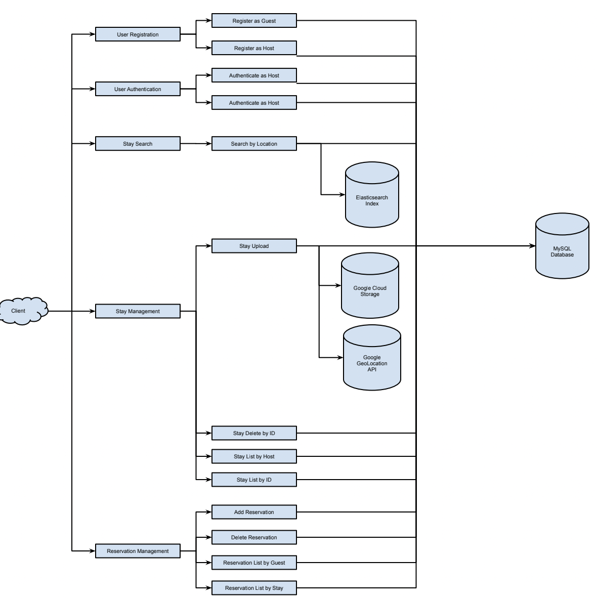
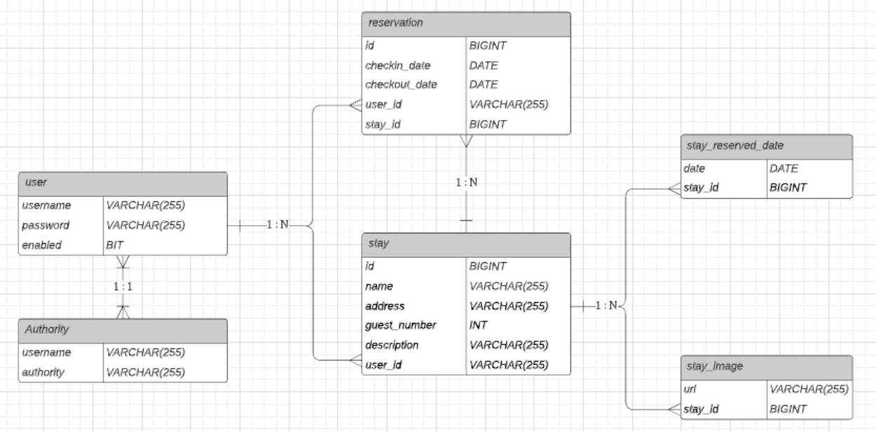

# HouseBooking

## Description

There are two roles in this application: host and guest. Visitors have to register an account and login into application when they want to publish or browse house information in this application.

Host:

- Pulish and remove house information for reservation.
- View reservation information.

Guest:

- View house information.
- Reserve or cancel house booking.

## App URL

https://prod.d5kpl5b8wylbn.amplifyapp.com

## Code Structure

## Data Model

